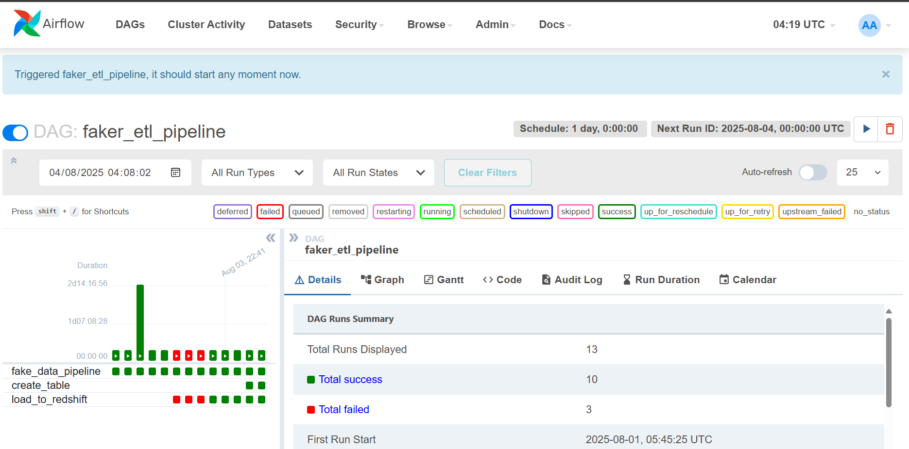

# Project: ETL Pipeline: Fake Order Data to S3 & Redshift

---
### Description:
This is a lightweight ETL pipeline that does one job fairly well: it generates fake order data, writes it to Amazon S3 in Parquet format, and sets up a corresponding table in Redshift (if it's not already there).
---
It’s meant for testing, demo purposes, or wherever you need large-ish volumes of realistic dummy data.

What It Does
Generates fake order data
Uses the Faker library to simulate customer names, addresses, dates, quantities, and prices. The number of records is random — anywhere between 500,000 and 1 million.

Writes to S3
Converts the data into a pandas DataFrame and saves it in Parquet format to a specified S3 bucket and folder, using awswrangler.

Creates a Redshift table (if missing)
Ensures there's a table in Redshift called orders with the right schema. Doesn't load any data into it, just sets it up.

Requirements
Make sure you have the following:

Python 3.x

awswrangler

boto3

pandas

faker

Apache Airflow (for handling Variable)

Access to:

An S3 bucket

AWS credentials (stored as Airflow variables: access_key, secret_key, region)

A Redshift connection configured in Airflow (postgres_conn_id="redshift")
